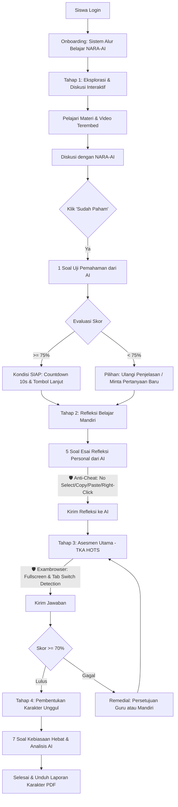

# 📚 NARA-AI Integrated Learning System Overview (Litra-AI)

This document provides a highly comprehensive, state-of-the-art overview of the updated **NARA-AI Integrated Learning System (Litra-AI)** at **SMP Negeri 1 Balikpapan**. It serves as the ultimate architectural and pedagogical blueprint, aligning the application's onboarding guide, main app shell navigation, backend controllers, security controls, and advanced AI services.

---

## 🗺️ Alur Pembelajaran 4 Tahap (Integrated Workflow)

The diagram below illustrates the fully integrated student learning flow, showing how students transition through the 4 stages, how AI guides their understanding, and how anti-cheat and exambrowser security mechanisms are enforced.



---

## 🛠️ Rincian Logika, Fitur & Teknis Setiap Tahap

### 1. Tahap 1: Eksplorasi & Diskusi Interaktif
* **Fokus Utama:** Pembelajaran mandiri aktif berbasis interaksi dialogis interaktif dengan asisten virtual bertenaga AI.
* **Mekanisme Kerja:**
  * Siswa mengakses modul pembelajaran (format PDF atau HTML dinamis) yang dikonfigurasi berdasarkan kelas atau tingkat mereka.
  * Berdiskusi secara real-time dengan **NARA-AI** (Asisten Virtual Guru) menggunakan bahasa Indonesia baku (EYD) yang santun, ramah, dan suportif.
  * **Penyaring Konteks (Context Filtering):** Jika siswa bertanya di luar topik materi yang sedang dibuka, NARA-AI mendeteksi penyimpangan tersebut dan memberikan tanggapan terstandar untuk memfokuskan kembali perhatian siswa pada materi terpilih.
* **Fitur Canggih - AI Learning Material Generator:**
  * Guru dapat meracik materi pembelajaran HTML premium dalam hitungan detik.
  * AI menyusun konten pembelajaran lengkap setara beberapa halaman A4 berdasarkan indikator, tujuan pembelajaran, dan kelas target.
  * **Penyisipan Gambar Kontekstual:** AI secara otomatis menyisipkan gambar ilustrasi botani/sains detail yang dihasilkan secara real-time via *Pollinations AI* or gambar berlisensi gratis via *LoremFlickr*.
  * **Video Edukatif Terembed:** Sistem menyematkan pemutar video edukatif YouTube resmi menggunakan ID video terverifikasi (Sains, Matematika, Bahasa Indonesia, IPS, dsb.) untuk mencegah error "video tidak tersedia".
  * **Editor Inline Interaktif:** Guru memiliki akses penuh untuk menyunting konten HTML langsung dalam mode pratinjau sebelum materi dirilis ke siswa.
* **Gerbang Transisi Tahap 2 (Understanding Check):**
  * Tombol **"Sudah Paham"** memicu NARA-AI untuk membangkitkan **1 Soal Uji Pemahaman** kritis berdasarkan riwayat penjelasan terakhir.
  * Jawaban esai siswa dianalisis secara instan oleh backend (`analyzeUnderstanding`) menghasilkan skor 0-100.
  * **Automated countdown 10 detik** melayang memandu siswa secara halus untuk bertransisi secara otomatis ke Tahap 2, didampingi tombol manual **"Lanjut ke Tahap 2"** dengan efek animasi pulse berpendar.

### 2. Tahap 2: Refleksi Belajar Mandiri
* **Fokus Utama:** Refleksi kognitif mendalam dan pengukuran tingkat kesiapan siswa secara subjektif.
* **Mekanisme Kerja:**
  * AI menganalisis transkrip obrolan di Tahap 1, lalu merumuskan **5 pertanyaan esai reflektif** yang dipersonalisasi khusus berdasarkan interaksi belajar siswa.
  * Siswa menjawab esai reflektif tersebut secara mandiri dan jujur.
  * Jawaban esai dianalisis oleh AI (`analyzeReadiness`) untuk memetakan skor kesiapan belajar siswa sebelum memasuki asesmen kognitif utama.
* **🛡️ Proteksi Keamanan (Anti-Cheat Engine):**
  * Area pengerjaan dilindungi secara ketat menggunakan JavaScript dan CSS:
    * Menyembunyikan atau mematikan menu klik kanan (`contextmenu`).
    * Memblokir pintasan keyboard salin (`copy`) dan tempel (`paste`).
    * Menyembunyikan penyeleksian teks (`user-select: none; -webkit-user-select: none;`).

### 3. Tahap 3: Asesmen Utama (TKA - HOTS)
* **Fokus Utama:** Evaluasi kognitif standar nasional (PISA & ANBK-like) berbasis soal pilihan ganda berkategori HOTS (Higher Order Thinking Skills).
* **Mekanisme Kerja:**
  * Soal asesmen di-generate secara dinamis dari Bank Soal (Literasi & Numerasi) dengan tingkat penalaran logis level 1 hingga level 5.
  * Durasi ujian diatur secara dinamis oleh Guru via menu Penjadwalan Waktu Akses (default: 90 menit) yang terintegrasi dengan timer global di bar atas.
  * Nilai kelulusan minimum (**KKM**) dipatok sebesar **70%**.
* **🛡️ Fitur Exambrowser Terintegrasi:**
  * Memaksa browser masuk ke mode **Layar Penuh (Fullscreen)** saat pengerjaan dimulai.
  * Mendeteksi dan mencatat pelanggaran perpindahan tab/jendela browser (`visibilitychange`). Setiap aktivitas keluar tab memicu notifikasi peringatan keras ke siswa dan tersinkronisasi secara real-time ke dasbor pemantauan guru.
* **Remedial Access Control:**
  * Jika siswa memperoleh skor di bawah KKM 70%, status progres mereka ditransisikan ke mode remedial. Bergantung pada konfigurasi kelas, siswa dapat langsung remedial secara mandiri atau membutuhkan persetujuan guru (*waiting approval*) untuk mendapatkan kesempatan ujian ulang.

### 4. Tahap 4: Pembentukan Karakter Unggul
* **Fokus Utama:** Evaluasi afektif serta pembentukan profil Pelajar Pancasila yang tangguh.
* **Mekanisme Kerja:**
  * Siswa mengisi esai refleksi pengamalan **7 Kebiasaan Hebat Anak Indonesia** (Bangun pagi, Ibadah rutin, Olahraga teratur, Makan makanan sehat, Belajar mandiri, Bermasyarakat/saling membantu, Disiplin waktu tidur).
  * Jawaban siswa dianalisis secara mendalam oleh AI (`analyzeHabits`) untuk melahirkan umpan balik afektif dan persentase skor pembentukan karakter.
  * Siswa yang telah menuntaskan Tahap 4 membuka akses penuh untuk mengunduh **Laporan PDF Resmi** yang memuat:
    * Watermark dan Kop resmi SMP Negeri 1 Balikpapan.
    * Grafik pencapaian Literasi & Numerasi.
    * Detail analisis kompetensi kognitif dan karakter afektif dari kecerdasan buatan.

---

## 📊 Dasbor Guru & Manajemen Absensi

Sistem Litra-AI dilengkapi dengan area pengelolaan kelas dan laporan guru yang sangat lengkap dan fungsional:

### 1. Dasbor Laporan & Grafik Pencapaian
* Menampilkan metrik utama kelas secara real-time: Total Siswa, Lulus Asesmen, Siswa Butuh Bimbingan, dan Siswa Belum Asesmen.
* Visualisasi grafik lingkaran (**Pie Chart Chart.js**) yang interaktif untuk memetakan persentase ketuntasan literasi dan numerasi per kelas.
* Tabel pemantauan progres langkah belajar siswa (Tahap 1 s/d Tahap 4) yang dilengkapi fitur reset progres secara massal.

### 2. Manajemen Absensi Historis (Update Terbaru)
* **Pencatatan Absensi Harian:** Guru dapat mencatat kehadiran siswa dengan status Hadir, Sakit, Izin, atau Alpha.
* **Pelacakan Riwayat Komprehensif:** Dilengkapi filter rentang tanggal (*startDate* dan *endDate*) serta filter per kelas guna melihat rekam jejak kehadiran masa lalu tanpa risiko ter-overwrite.
* **Ringkasan Kehadiran Otomatis:** Dasbor menyajikan ringkasan persentase kehadiran serta rincian akumulasi sakit, izin, dan alpha siswa.
* **Ekspor PDF Profesional:** Guru dapat langsung mengunduh laporan absensi berformat PDF premium dengan desain visual bersih, kop surat SMP Negeri 1 Balikpapan, tanda tangan guru, dan tanda air (*watermark*) sekolah.

---

## ⚙️ Arsitektur Backend & Integrasi AI

Backend aplikasi didesain dengan tingkat keandalan tinggi berbasis Node.js, Express, dan MongoDB:

```
┌────────────────────────────────────────────────────────┐
│                      FRONTEND APP                      │
│        HTML5, Vanilla CSS, JS (App Shell Framework)     │
└───────────────────────────┬────────────────────────────┘
                            │ (REST APIs / JSON)
                            ▼
┌────────────────────────────────────────────────────────┐
│                     EXPRESS SERVER                     │
│                  (server.js & Router)                  │
└───────────────────────────┬────────────────────────────┘
                            │
            ┌───────────────┴───────────────┐
            ▼                               ▼
┌───────────────────────┐       ┌───────────────────────┐
│     MONGODB ATLAS     │       │      AI SERVICE       │
│  (Mongoose Schemas)   │       │ (OpenRouter / Groq /  │
│                       │       │    Google AI Studio)  │
│  - Users & Attendance │       │                       │
│  - Student Progress   │       │  - Fallback Models    │
│  - Material & Bank    │       │  - Exponential Delay  │
│  - Violations Log     │       │  - Strict Prompting   │
└───────────────────────┘       └───────────────────────┘
```

### 1. Model & Skema Data Utama
* **`User.js`**: Menyimpan kredensial akun, kelas, foto profil, peran (admin/guru/siswa), serta status *mustChangePassword*.
* **`Attendance.js`**: Menyimpan data kehadiran per siswa per tanggal dengan operasi `bulkWrite` MongoDB untuk efisiensi penyimpanan massal.
* **`Progress.js`**: Menyimpan status tahapan belajar siswa, rekaman jawaban refleksi, skor asesmen kognitif, analisis karakter afektif AI, status persetujuan remedial, dan status antrian chat aktif.
* **`QuestionBank.js`**: Menyimpan bank soal HOTS lengkap dengan indikator soal, pembahasan, dan level penalaran logis 1-5.
* **`Violation.js`**: Menyimpan log kecurangan siswa (tab switch, exit fullscreen) secara otomatis untuk pengawasan guru.

### 2. Layanan AI & Keamanan Antrian (Queue System)
* **Multi-API Key Rotation:** Backend memproses rotasi beberapa API Key secara dinamis untuk mencegah penolakan kuota (*rate limit*).
* **Automated Fallback Models:** Jika model utama (`llama-3.3-70b-versatile`) mengalami kegagalan, sistem secara otomatis mengalihkan request ke model cadangan (`llama-3.1-8b-instant`, `gemma2-9b-it`, `mixtral-8x7b-32768`) secara transparan tanpa mengganggu siswa.
* **Sistem Antrian Chatbot (Chat Queue):** Membatasi jumlah siswa yang berdiskusi aktif secara bersamaan (maksimal 50 siswa) untuk menjaga stabilitas memori server dan kuota API.

---

## 💎 Estetika Desain & Responsive Layout

Sistem dirancang dengan estetika visual kelas atas (premium feel):
* **Glassmorphism Design:** Penggunaan latar belakang semi-transparan yang membiaskan cahaya (`backdrop-filter: blur()`), dikombinasikan dengan border halus dan bayangan menyebar (`box-shadow`) untuk efek melayang modern.
* **Curated Harmonious Colors:** Menggunakan variabel CSS HSL/RGB terkurasi tinggi (biru tua futuristik, hijau zamrud untuk sukses, merah lembut untuk peringatan).
* **Premium Micro-animations:** Transisi hover lembut, efek denyut nadi (*pulse*) pada tombol penting, dan animasi geser ke atas (*slide-up*) saat memuat komponen halaman.
* **Responsive Layouts:** Pemanfaatan *Responsive Media Queries* di `styles.css` his-to-date untuk memastikan aplikasi tampil sempurna dan proporsional saat diakses melalui smartphone, tablet, maupun komputer.
